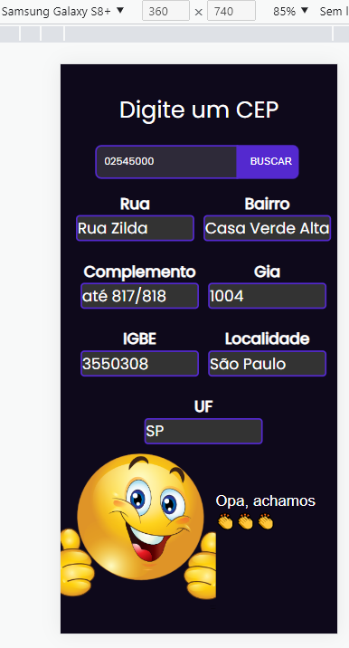

# Buscar CEP Via API - ViaCep ✔ ⚙ 🔎

Aplicação feita em Javascript, para consultar CEP de endereçamento do Brasil gratuitamente. Para Consultar CEP basta você fazer uma **requisição http** para a **API do ViaCep** e então obter o retorno com informações como **CEP**, nome da **Cidade**, **Código do Município**, **UF**, etc

# Imagens 📸

---
<h3 align="center">Technologies </h3>

| Name       | NameIcon                                                     | About the tecnologies used                                   |
| ---------- | ------------------------------------------------------------ | ------------------------------------------------------------ |
| Javascript |  | 
JavaScript, often abbreviated JS, is a programming language that is one of the core technologies of the World Wide Web, alongside HTML and CSS. Over 97% of websites use JavaScript on the client side for web page behavior, often incorporating third-party libraries. All major web browsers have a dedicated JavaScript engine to execute the code on users' devices.
 |
| CSS3       |  | 
Cascading Style Sheets (CSS) is a style sheet language used for describing the presentation of a document written in a markup language such as HTML. CSS is a cornerstone technology of the World Wide Web, alongside HTML and JavaScript.
 |
| HTML5       |  | 
HTML5 is a markup language used for structuring and presenting content on the World Wide Web. It is the fifth and last major HTML version that is a World Wide Web Consortium (W3C) recommendation. The current specification is known as the HTML Living Standard. It is maintained by the Web Hypertext Application Technology Working Group (WHATWG), a consortium of the major browser vendors (Apple, Google, Mozilla, and Microsoft).
 |

